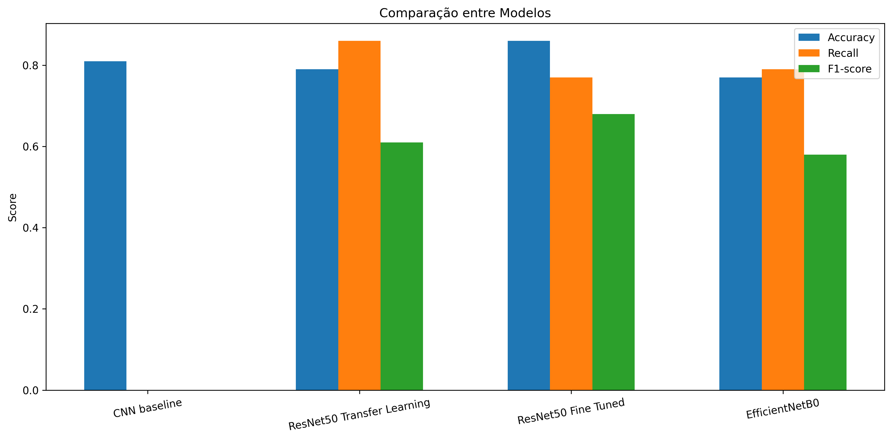
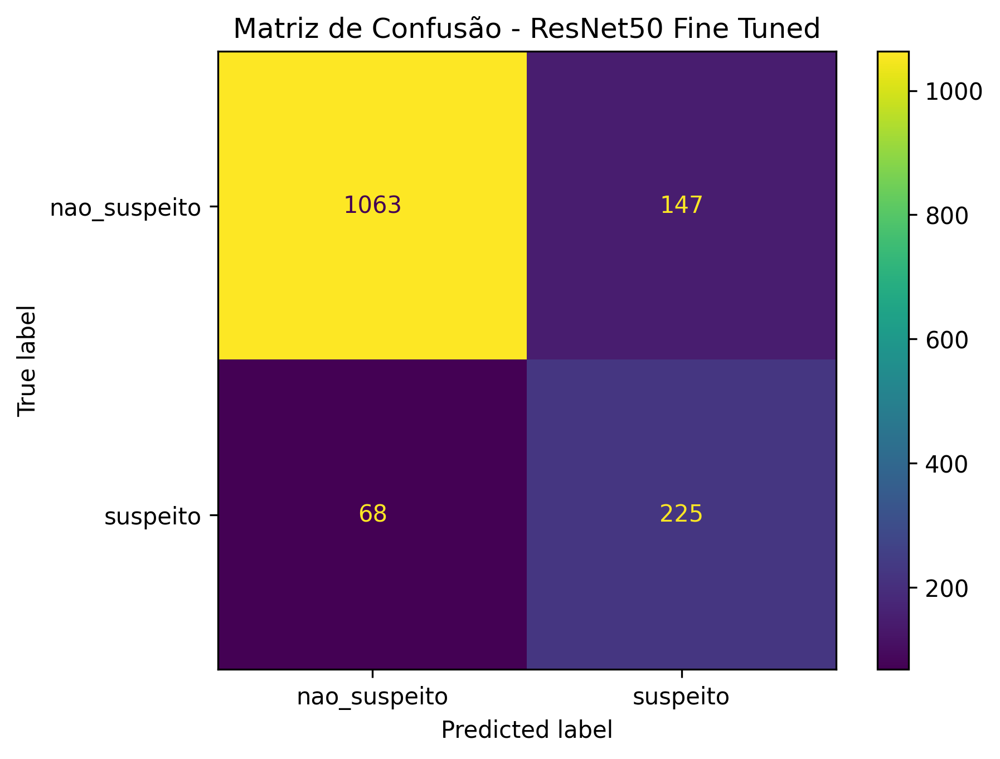
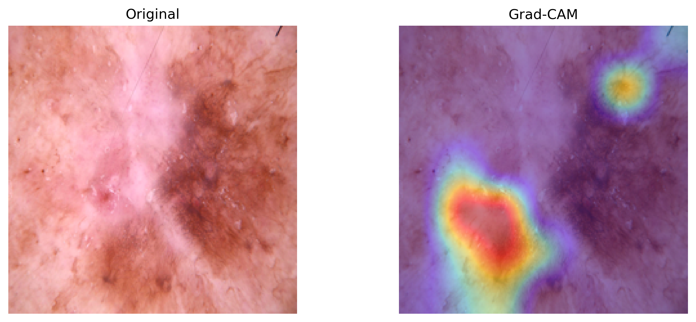
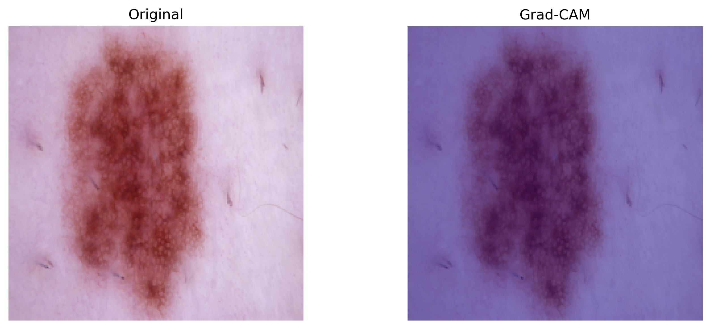
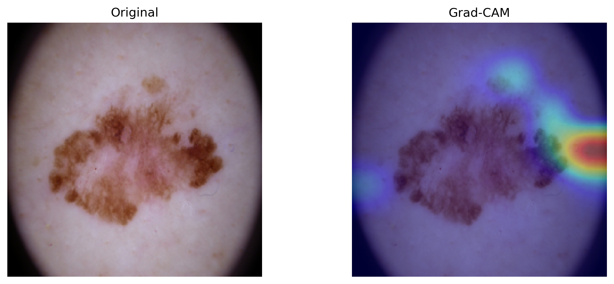
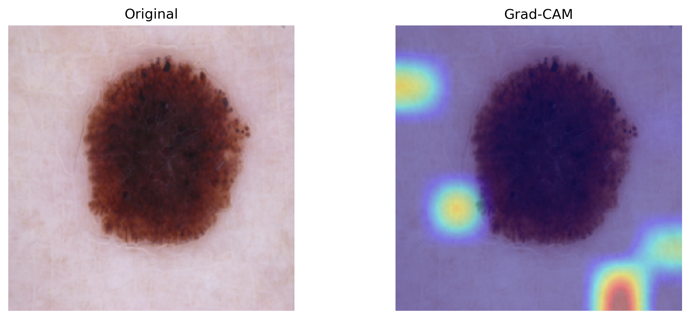

# SkinNet

Pipeline convolucional de deep learning voltado à classificação binária de lesões cutâneas dermatoscópicas, integrando técnicas de transfer learning, fine-tuning seletivo e interpretabilidade pós-hoc por meio do Grad-CAM no benchmark HAM10000.

---

## Dataset

**HAM10000** — conjunto composto por 10.015 imagens dermatoscópicas distribuídas em sete categorias diagnósticas, particionadas em subconjuntos de treinamento (7.010), validação (1.502) e teste (1.503). Todas as imagens foram redimensionadas para 224 × 224 pixels. O desbalanceamento entre classes foi mitigado por meio de aprendizado sensível a custo, utilizando funções de perda ponderadas.

🔗 [Tschandl et al., Scientific Data, 2018](https://www.kaggle.com/datasets/kmader/skin-cancer-mnist-ham10000)

---

## Protocolo de Classificação

As sete categorias diagnósticas do HAM10000 foram agregadas em duas classes clinicamente orientadas:

| Classe | Categorias |
|-------|-----------|
| **Suspeita** | Melanoma `mel` · Carcinoma Basocelular `bcc` · Ceratose Actínica `akiec` |
| **Não suspeita** | Nevos Melanocíticos `nv` · Lesões Semelhantes à Ceratose Benigna `bkl` · Lesões Vasculares `vasc` · Dermatofibroma `df` |

---

## Resultados

| Modelo | Accuracy | Precision | Recall | F1-score |
|-------|----------|-----------|--------|----|
| CNN Baseline | 0.81 | 0.00 | 0.00 | 0.00 |
| ResNet50 Transfer Learning | 0.79 | 0.47 | 0.86 | 0.61 |
| **ResNet50 Fine-Tuned** | **0.86** | **0.60** | **0.77** | **0.68** |
| EfficientNetB0 | 0.77 | 0.45 | 0.79 | 0.58 |

> As métricas foram reportadas para a classe positiva (“suspeita”). A CNN baseline apresentou colapso para a classe majoritária, resultando em ausência de capacidade discriminativa para a classe minoritária.

### ResNet50 Fine-Tuned — Relatório de Classificação por Classe

| Classe | Precision | Recall | F1-score | Support |
|-------|-----------|--------|----|---------|
| Não suspeita | 0.94 | 0.88 | 0.91 | 1.210 |
| Suspeita | 0.60 | 0.77 | 0.68 | 293 |
| Média macro | 0.77 | 0.82 | 0.79 | 1.503 |

> Das 293 lesões classificadas como suspeitas, 225 foram corretamente identificadas (recall = 0.77), resultando em 68 falsos negativos. Em cenários de triagem clínica, falsos negativos representam risco significativo devido à não detecção de possíveis malignidades.

---

## Interpretabilidade

O método Gradient-weighted Class Activation Mapping (Grad-CAM) foi empregado para a geração de mapas de saliência discriminativos por classe, permitindo localizar espacialmente as regiões de maior influência nas predições realizadas pelos modelos. Essa abordagem amplia a auditabilidade pós-hoc e a interpretabilidade em aplicações de imagem médica, possibilitando avaliar se a atenção do modelo está alinhada a características morfológicas clinicamente relevantes.

| | |
|---|---|
|  |  |
| **Verdadeiro Positivo** — ativação concentrada sobre a região da lesão, consistente com padrões morfológicos clinicamente relevantes | **Verdadeiro Negativo** — baixa ativação sobre a lesão, corretamente associada a um padrão não suspeito |
|  |  |
| **Falso Positivo** — ativação deslocada para regiões externas à lesão, indicando influência de características espúrias na classificação | **Falso Negativo** — ativação difusa e espacialmente dispersa, refletindo sinal discriminativo insuficiente para detecção de malignidade |

---

## Aviso

Este projeto foi desenvolvido exclusivamente para fins acadêmicos e de pesquisa. Não se trata de um dispositivo médico e não deve ser utilizado como substituto de diagnóstico clínico profissional.

---

## Referências

- Tschandl, P. et al. *HAM10000 dataset.* Scientific Data, 2018.
- Selvaraju, R. R. et al. *Grad-CAM: Visual Explanations from Deep Networks via Gradient-based Localization.* ICCV, 2017.
- He, K. et al. *Deep Residual Learning for Image Recognition.* CVPR, 2016.
- Tan, M.; Le, Q. V. *EfficientNet: Rethinking Model Scaling for Convolutional Neural Networks.* ICML, 2019.

---

## Autor

**Lucas Marques**  
Engenharia de Software · Desenvolvimento de Software · Administração de Bancos de Dados

---

## Licença

[MIT](LICENSE)
