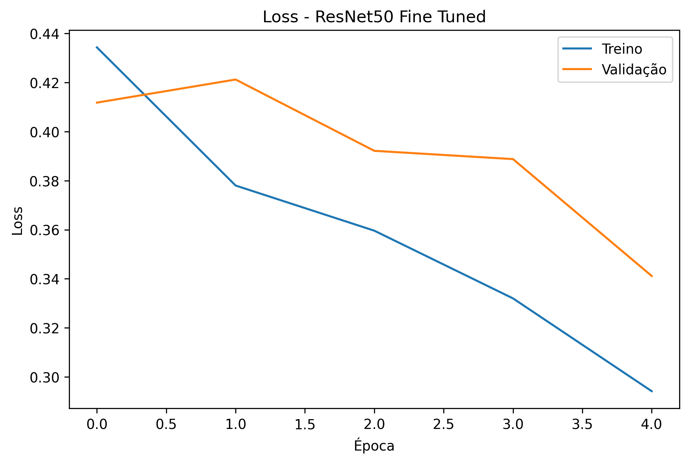
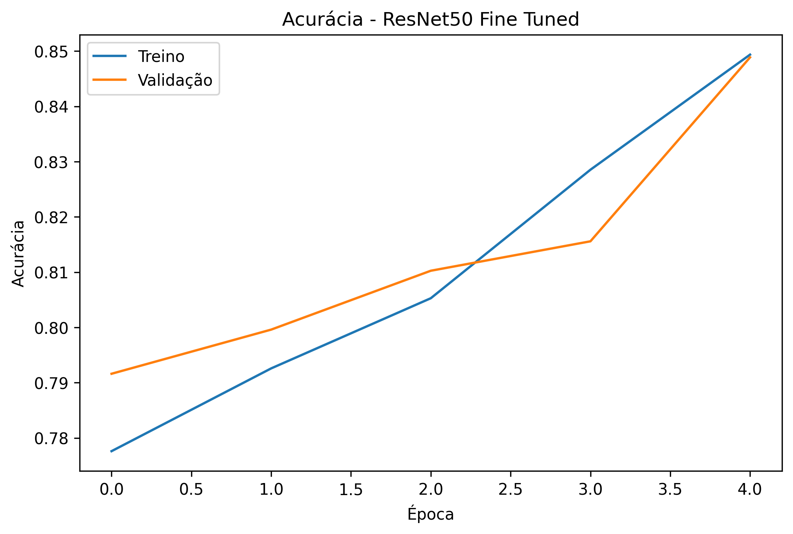

# SkinNet

```
Deep learning pipeline for dermoscopic skin lesion classification
using CNNs, transfer learning, fine-tuning and Grad-CAM interpretability.
```


---

## Introduction

This project presents a deep learning pipeline for binary classification of dermoscopic skin lesions suggestive of skin cancer using convolutional neural networks (CNNs), transfer learning, fine-tuning and Grad-CAM explainability techniques.

The project uses the HAM10000 dataset and compares different deep learning architectures, including:

- Baseline CNN
- ResNet50 with Transfer Learning
- ResNet50 Fine-Tuned *(best model)*
- EfficientNetB0

---

## Objective

Develop and evaluate deep learning models capable of classifying dermoscopic skin lesion images into:

- **Suspicious lesions** — potentially malignant
- **Non-suspicious lesions** — benign

---

## Dataset

**HAM10000 — Human Against Machine with 10000 Training Images**

> A large collection of multi-source dermatoscopic images of common pigmented skin lesions.

🔗 [Kaggle — Skin Cancer MNIST: HAM10000](https://www.kaggle.com/datasets/kmader/skin-cancer-mnist-ham10000)

| Split | Images |
|-------|--------|
| Train | 7,010 |
| Validation | 1,502 |
| Test | 1,503 |
| **Total** | **10,015** |

> Input images resized to **224×224 px** (RGB).

---

## Binary Classification Strategy

| Class | Lesion Types |
|-------|-------------|
| 🔴 **Suspicious** | Melanoma `mel`, Basal Cell Carcinoma `bcc`, Actinic Keratoses `akiec` |
| 🟢 **Non-suspicious** | Melanocytic Nevi `nv`, Benign Keratosis-like Lesions `bkl`, Vascular Lesions `vasc`, Dermatofibroma `df` |

---

## Results

### Overall Comparison


| Model | Accuracy | Precision | Recall | F1-score |
|-------|----------|-----------|--------|----------|
| CNN Baseline | 0.81 | — | — | — |
| ResNet50 Transfer Learning | 0.79 | 0.47 | 0.86 | 0.61 |
| **ResNet50 Fine-Tuned** | **0.86** | **0.60** | 0.77 | **0.68** |
| EfficientNetB0 | 0.77 | 0.45 | 0.79 | 0.58 |

> Metrics reported for the **suspicious class** (positive class). CNN Baseline failed to learn the minority class (precision/recall = 0).

---

### Best Model — ResNet50 Fine-Tuned

#### Classification Report

| Class | Precision | Recall | F1-score | Support |
|-------|-----------|--------|----------|---------|
| Non-suspicious | 0.94 | 0.88 | 0.91 | 1,210 |
| Suspicious | 0.60 | 0.77 | 0.68 | 293 |
| **Macro avg** | **0.77** | **0.82** | **0.79** | 1,503 |
| **Weighted avg** | **0.87** | **0.86** | **0.86** | 1,503 |

#### Confusion Matrix


#### Training Curves




---

## Explainability with Grad-CAM

Gradient-weighted Class Activation Mapping (Grad-CAM) was applied to generate saliency maps that highlight the image regions most influential to model predictions, improving spatial interpretability in dermoscopic image analysis.

> *Grad-CAM visualizations coming soon.*

---

## Project Structure

```txt
skinnet/
│
├── notebooks/        # Jupyter notebooks (EDA, training, evaluation)
├── models/           # Saved model weights (.keras)
├── results/          # Metrics, plots, confusion matrices, Grad-CAM outputs
│   ├── gradcam_examples/
│   ├── models_comparison.png
│   ├── confusion_matrix_resnet50_finetuned.png
│   ├── loss_resnet50_finetuned.png
│   ├── accuracy_resnet50_finetuned.png
│   ├── metrics_comparison.csv
│   └── experiment_metadata.json
├── api/              # Inference API
├── frontend/         # Web interface
└── docs/             # Documentation and references
```

---

## Installation

```bash
git clone https://github.com/seu-usuario/skinnet.git
cd skinnet
pip install -r requirements.txt
```

---

## How to Run

Run the notebooks in the following order:

```
1. notebooks/01_eda.ipynb              # Exploratory Data Analysis
2. notebooks/02_baseline_cnn.ipynb     # Baseline CNN
3. notebooks/03_resnet50_tl.ipynb      # ResNet50 Transfer Learning
4. notebooks/04_resnet50_ft.ipynb      # ResNet50 Fine-Tuned
5. notebooks/05_efficientnet.ipynb     # EfficientNetB0
6. notebooks/06_gradcam.ipynb          # Grad-CAM Explainability
```

> All notebooks were developed and tested on **Google Colab** with GPU runtime (T4).

---

## References

- Tschandl, P. et al. *The HAM10000 dataset, a large collection of multi-source dermatoscopic images of common pigmented skin lesions.* Scientific Data, 2018.
- Selvaraju, R. R. et al. *Grad-CAM: Visual Explanations from Deep Networks via Gradient-based Localization.* ICCV, 2017.
- He, K. et al. *Deep Residual Learning for Image Recognition.* CVPR, 2016.
- Tan, M. & Le, Q. V. *EfficientNet: Rethinking Model Scaling for Convolutional Neural Networks.* ICML, 2019.

---

## Author

**Lucas Marques**
Trabalho de Conclusão de Curso (TCC) — 2025
Classificação Computacional de Lesões Cutâneas Sugestivas de Câncer de Pele

---

## License

This project is licensed under the [MIT License](LICENSE).
